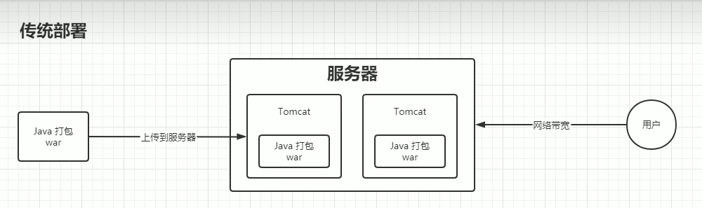
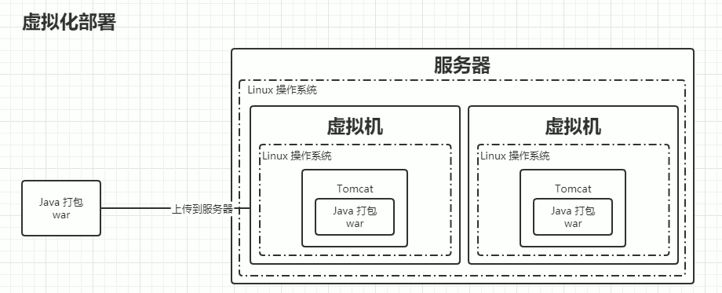
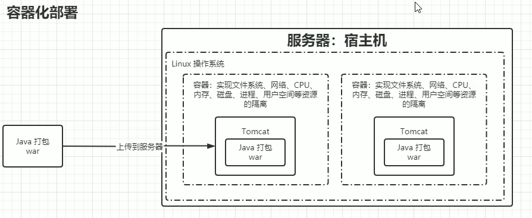

# 应用程序部署的三个时代

## 1. 传统部署
互联网早期，会直接将应用程序部署在物理机上。

**优点：**
- 简单，不需要其它技术的参与

**缺点：**
- 不能为应用程序定义资源使用边界
- 很难合理地分配计算资源
- 程序之间容易产生影响

## 2. 虚拟化部署
可以在一台物理机上运行多个虚拟机，每个虚拟机都是独立的一个环境。

**优点：**
- 程序环境不会相互产生影响
- 提供了一定程度的安全性

**缺点：**
- 增加了操作系统，浪费了部分资源

## 3. 容器化部署
与虚拟化类似，但是共享了操作系统。

**优点：**
- 可以保证每个容器拥有自己的文件系统、CPU、内存、进程空间等
- 运行应用程序所需要的资源都被容器包装，并和底层基础架构解耦
- 容器化的应用程序可以跨云服务商、跨Linux操作系统发行版进行部署

**问题：**
容器化部署方式给带来很多的便利，但是也会出现一些问题，比如说：
- 一个容器故障停机了，怎么样让另外一个容器立刻启动去替补停机的容器
- 当并发访问量变大的时候，怎么样做到横向扩展容器数量

这些容器管理的问题统称为容器编排问题，为了解决这些容器编排问题，就产生了一些容器编排的软件：

**Kubernetes：** Google开源的的容器编排工具,为了让应用的部署更加快捷
