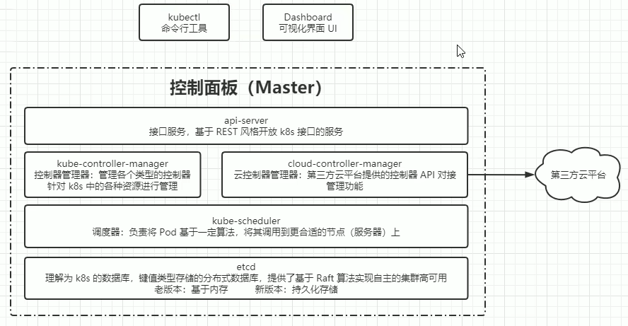
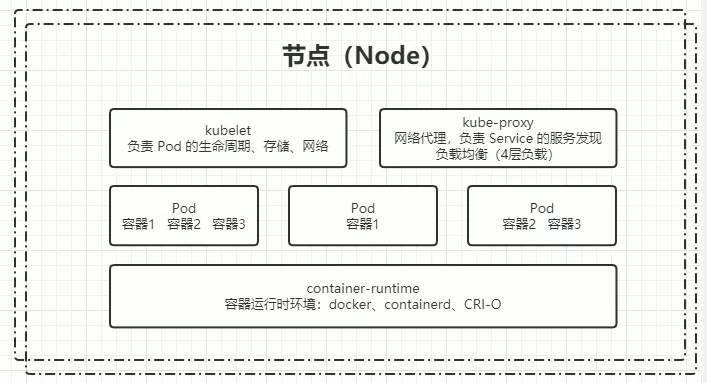

kubernetes的本质是一组服务器集群，它可以在集群的每个节点上运行特定的程序，来对节点中的容器进行管理。目的是实现资源管理的自动化，主要提供了如下的主要功能：

自我修复：一旦某一个容器崩溃，能够在1秒中左右迅速启动新的容器
弹性伸缩：可以根据需要，自动对集群中正在运行的容器数量进行调整
服务发现：服务可以通过自动发现的形式找到它所依赖的服务
负载均衡：如果一个服务起动了多个容器，能够自动实现请求的负载均衡
版本回退：如果发现新发布的程序版本有问题，可以立即回退到原来的版本
存储编排：可以根据容器自身的需求自动创建存储卷

## 1. kubernetes组件
一个kubernetes集群主要是由控制节点(master)、工作节点(node)构成，每个节点上都会安装不同的组件。

master：集群的控制平面，负责集群的决策 ( 管理 )
ApiServer : 资源操作的唯一入口，接收用户输入的命令，提供认证、授权、API注册和发现等机制
Scheduler : 负责集群资源调度，按照预定的调度策略将Pod调度到相应的node节点上
ControllerManager : 负责维护集群的状态，比如程序部署安排、故障检测、自动扩展、滚动更新等
Etcd ：负责存储集群中各种资源对象的信息

node：集群的数据平面，负责为容器提供运行环境 ( 干活 )
Kubelet : 负责维护容器的生命周期，即通过控制docker，来创建、更新、销毁容器
KubeProxy : 负责提供集群内部的服务发现和负载均衡
Docker : 负责节点上容器的各种操作
