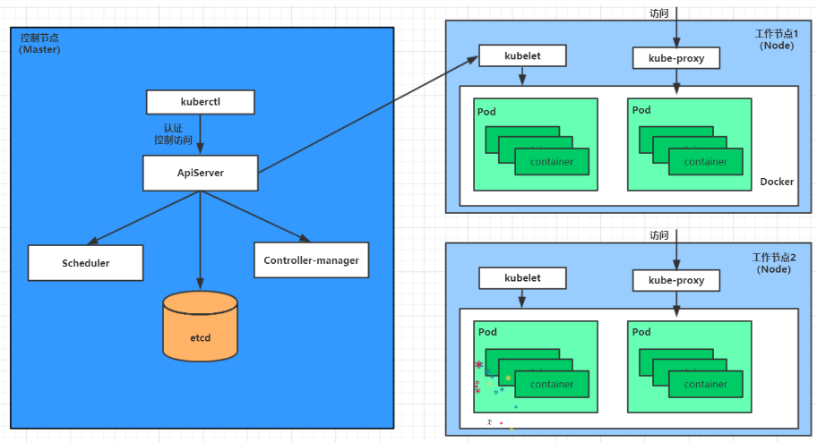

# Kubernetes 概述

Kubernetes 是一组服务器集群，旨在自动化容器的部署、扩展和操作，实现资源管理的自动化。它提供了以下主要功能：

- **自我修复**：一旦某一个容器崩溃，能够迅速启动新的容器
- **弹性伸缩**：根据需要自动调整正在运行的容器数量
- **服务发现**：服务可以自动发现它所依赖的服务
- **负载均衡**：自动实现请求的负载均衡
- **版本回退**：如果新发布的程序版本有问题，可以立即回退
- **存储编排**：根据容器需求自动创建存储卷

## Kubernetes 组件

Kubernetes 集群主要由控制节点（Master）和工作节点（Node）构成，每个节点上都安装有不同的组件。

### Master（控制节点）

- **ApiServer**：资源操作的唯一入口，提供认证、授权、API注册和发现等机制
- **Scheduler**：负责集群资源调度，将Pod调度到相应的Node节点上
- **ControllerManager**：维护集群状态，如程序部署、故障检测、自动扩展等
- **Etcd**：存储集群中各种资源对象的信息

### Node（工作节点）

- **Kubelet**：维护容器的生命周期，控制Docker创建、更新、销毁容器
- **KubeProxy**：提供集群内部的服务发现和负载均衡
- **Docker**：节点上容器的操作

## Kubernetes 工作流程

以部署一个nginx服务为例，说明Kubernetes系统各组件的调用关系：

1. 安装请求发送到Master节点的ApiServer组件。
2. ApiServer调用Scheduler组件决定服务安装到哪个Node节点上。
3. Scheduler从Etcd中读取Node信息，选择一个Node，并将结果告知ApiServer。
4. ApiServer调用ControllerManager去调度Node节点安装nginx服务。
5. Kubelet接收到指令，通知Docker启动nginx的Pod。
6. 如果需要访问nginx，通过KubeProxy对Pod进行访问代理。

## Kubernetes 概念

- **Master**：集群控制节点，负责集群的管理。
- **Node**：工作节点，运行容器。
- **Pod**：Kubernetes的最小操作单元，容器运行在Pod中。
- **Controller**：通过它实现对Pod的管理。
- **Service**：Pod对外服务的统一入口。
- **Label**：用于对Pod进行分类。
- **NameSpace**：用来隔离Pod的运行环境。