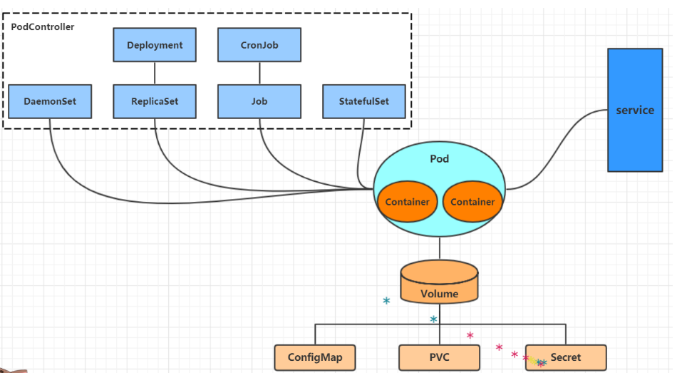

资源管理

在kubernetes中，所有的内容都抽象为资源，用户需要通过操作资源来管理kubernetes。
kubernetes的本质上就是一个集群系统，用户可以在集群中部署各种服务，所谓的部署服务，其实就是在kubernetes集群中运行一个个的容器，并将指定的程序跑在容器中。

kubernetes的最小管理单元是pod而不是容器，所以只能将容器放在Pod中，而kubernetes一般也不会直接管理Pod，而是通过Pod控制器来管理Pod的。

Pod可以提供服务之后，就要考虑如何访问Pod中服务，kubernetes提供了Service资源实现这个功能。

当然，如果Pod中程序的数据需要持久化，kubernetes还提供了各种存储系统。


资源管理方式
命令式对象管理：直接使用命令去操作kubernetes资源
```bath
kubectl run nginx-pod --image=nginx:1.17.1 --port=80
```
